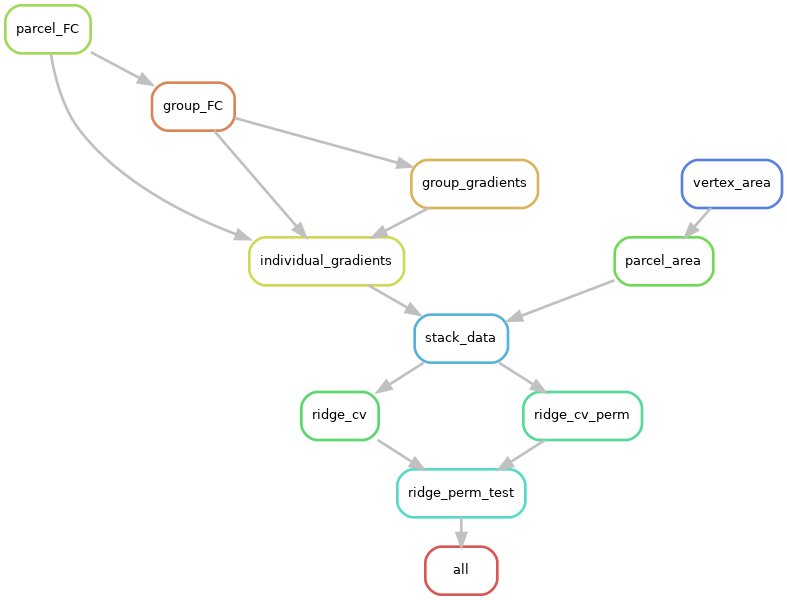

# AreoGrad Project

Work in progress (WIP): this Snakemake workflow computes parcel-wise cortical surface area and resting-state FC gradients for each subject, aligns gradients to a group reference, and evaluates whether gradient variability is associated with regional surface area using Ridge regression CV with permutation tests.

## DAG

